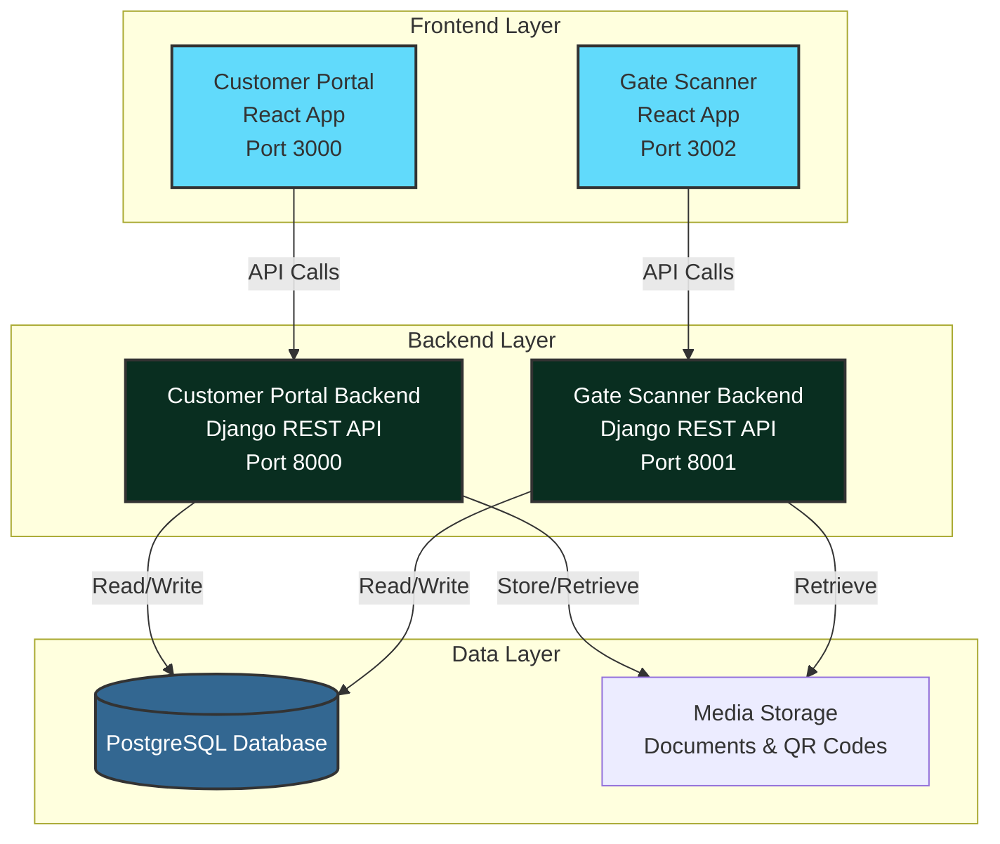

<div align="center">

# 🚀 Customer Web Portal & Gate Scanner System

### Secure Vehicle Gate Entry Management Solution

[](https://react.dev)
[](https://www.djangoproject.com/)
[](https://www.postgresql.org/)
[](LICENSE)

*A comprehensive, two-application system for managing secure vehicle gate entry submissions with QR code verification*

[Features](#-features) • [Architecture](#-architecture) • [Setup](#-quick-start) • [Documentation](#-api-documentation) • [Troubleshooting](#-troubleshooting)

</div>

---

## 📋 Table of Contents

- [Overview](#-overview)
- [Features](#-features)
- [Architecture](#-architecture)
- [Technology Stack](#-technology-stack)
- [Quick Start](#-quick-start)
  - [Prerequisites](#prerequisites)
  - [Customer Web Portal Setup](#1-customer-web-portal-setup)
  - [Gate Scanner App Setup](#2-gate-scanner-app-setup)
- [Database Configuration](#-database-configuration)
- [Project Structure](#-project-structure)
- [API Documentation](#-api-documentation)
- [Development Guide](#-development-guide)
- [Troubleshooting](#-troubleshooting)
- [Contributing](#-contributing)

---

## 🎯 Overview

This project comprises **two integrated React applications** with separate Django backends, designed to streamline and secure facility gate entry operations:

1. **Customer Web Portal** - Allows customers to pre-register vehicles, drivers, and documents to generate secure QR codes
2. **Gate Scanner App** - Enables gate personnel to scan QR codes, verify information, and manage vehicle entry

### System Flow

```mermaid
graph LR
    A[Customer] -->|Submits Info| B[Customer Portal]
    B -->|Generates| C[QR Code]
    C -->|Scanned at Gate| D[Gate Scanner App]
    D -->|Verifies| E[Backend API]
    E -->|Updates| F[(PostgreSQL DB)]
    D -->|Grants/Denies| G[Vehicle Entry]
    
    style B fill:#61dafb,stroke:#333,stroke-width:2px
    style D fill:#61dafb,stroke:#333,stroke-width:2px
    style E fill:#092e20,stroke:#333,stroke-width:2px
    style F fill:#336791,stroke:#333,stroke-width:2px
```



---

## ✨ Features

### 🌐 Customer Web Portal

- ✅ **Multi-Step Form Wizard** - Three-step process for vehicle, driver, and document information
- 🔐 **Token-Based Authentication** - Secure access control with JWT tokens
- 📄 **Document Management** - Upload POs, vehicle registration, insurance, PUC, licenses, and more
- 🎫 **QR Code Generation** - Automatic generation of secure entry QR codes
- 🌍 **Multi-Language Support** - English, Hindi, Marathi, Gujarati, and Tamil
- ✔️ **File Validation** - Supports PDF, JPG, JPEG, and PNG files up to 5MB
- 📱 **Responsive Design** - Mobile-friendly interface built with Tailwind CSS
- 🛡️ **Form Validation** - Comprehensive client-side validation

### 📱 Gate Scanner App

- 📷 **QR Code Scanning** - Real-time camera-based QR code verification
- ✅ **Entry Verification** - Validate pre-registered vehicles and drivers
- 📊 **Entry Management** - Track and manage vehicle entry/exit
- 🔔 **Real-Time Updates** - Live status updates and notifications
- 📋 **Driver/Vehicle Details** - View comprehensive submission information
- 🚦 **Entry Control** - Grant or deny access based on verification

---

## 🏗️ Architecture

### System Architecture Diagram



### Component Breakdown

| Component | Technology | Port | Purpose |
|-----------|-----------|------|---------|
| **Customer Portal Frontend** | React 19.2.0 | 3000 | Customer-facing submission interface |
| **Gate Scanner Frontend** | React 19.2.0 | 3002 | Gate personnel scanning interface |
| **Customer Portal Backend** | Django 4.2 + DRF | 8000 | Submission API & QR generation |
| **Gate Scanner Backend** | Django 5.0 + DRF | 8001 | Verification API & entry management |
| **Database** | PostgreSQL | 5432 | Centralized data storage |

---

## 💻 Technology Stack

### Frontend
- **Framework:** React 19.2.0
- **Styling:** Tailwind CSS 3.4.14+
- **Icons:** Lucide React
- **Build Tool:** Create React App with react-scripts 5.0.1
- **QR Scanning:** jsQR (Gate Scanner)
- **HTTP Client:** Axios
- **Testing:** Jest, React Testing Library

### Backend
- **Framework:** Django 4.2 / 5.0
- **API:** Django REST Framework 3.14
- **Authentication:** djangorestframework-simplejwt
- **Database Driver:** psycopg2-binary / psycopg[binary]
- **Image Processing:** Pillow
- **QR Code:** qrcode[pil]
- **CORS:** django-cors-headers
- **SMS:** Twilio (Gate Scanner)
- **Environment:** python-decouple, python-dotenv

### Database
- **Database:** PostgreSQL 12+
- **Schema:** Relational database with normalized tables

---

## 🚀 Quick Start

### Prerequisites

Before you begin, ensure you have the following installed:

- **Node.js** (v14 or higher) - [Download](https://nodejs.org/)
- **Python** (3.8 or higher) - [Download](https://www.python.org/downloads/)
- **PostgreSQL** (12 or higher) - [Download](https://www.postgresql.org/download/)
- **npm** or **yarn** - Comes with Node.js
- **pip** - Python package installer

### 1️⃣ Customer Web Portal Setup

#### Backend Setup

1. **Navigate to the backend directory:**
   ```bash
   cd backend/customer_portal_backend
   ```

2. **Create and activate a virtual environment:**
   ```bash
   # Windows
   python -m venv venv
   venv\Scripts\activate

   # macOS/Linux
   python3 -m venv venv
   source venv/bin/activate
   ```

3. **Install Python dependencies:**
   ```bash
   pip install -r requirements.txt
   ```

4. **Configure environment variables:**
   
   Create a `.env` file in `backend/customer_portal_backend/` with the following:
   ```env
   # Database Configuration
   DB_NAME=your_database_name
   DB_USER=your_database_user
   DB_PASSWORD=your_database_password
   DB_HOST=localhost
   DB_PORT=5432

   # Django Settings
   SECRET_KEY=your-secret-key-here
   DEBUG=True
   ALLOWED_HOSTS=localhost,127.0.0.1

   # CORS Settings
   CORS_ALLOWED_ORIGINS=http://localhost:3000

   # Email Configuration (optional)
   EMAIL_HOST=smtp.gmail.com
   EMAIL_PORT=587
   EMAIL_HOST_USER=your-email@gmail.com
   EMAIL_HOST_PASSWORD=your-email-password
   ```

5. **Initialize the database:**
   ```bash
   # Create database tables
   python manage.py makemigrations
   python manage.py migrate

   # Or use the provided SQL script
   python setup_django_tables.py
   ```

6. **Create a superuser (optional):**
   ```bash
   python manage.py createsuperuser
   ```

7. **Run the development server:**
   ```bash
   python manage.py runserver 8000
   ```

   ✅ Backend should now be running at `http://localhost:8000`

#### Frontend Setup

1. **Navigate to the frontend directory:**
   ```bash
   cd frontend/customer-portal
   ```

2. **Install dependencies:**
   ```bash
   npm install
   ```

3. **Configure the proxy (already set in package.json):**
   ```json
   "proxy": "http://localhost:8000"
   ```

4. **Start the development server:**
   ```bash
   npm start
   ```

   ✅ Customer Portal should now be running at `http://localhost:3000`

---

### 2️⃣ Gate Scanner App Setup

#### Backend Setup

1. **Navigate to the backend directory:**
   ```bash
   cd backend/gate_scanner_backend
   ```

2. **Create and activate a virtual environment:**
   ```bash
   # Windows
   python -m venv venv
   venv\Scripts\activate

   # macOS/Linux
   python3 -m venv venv
   source venv/bin/activate
   ```

3. **Install Python dependencies:**
   ```bash
   pip install -r requirements.txt
   ```

4. **Configure environment variables:**
   
   Create a `.env` file in `backend/gate_scanner_backend/` based on `.env.example`:
   ```env
   # Database Configuration
   DB_NAME=your_database_name
   DB_USER=your_database_user
   DB_PASSWORD=your_database_password
   DB_HOST=localhost
   DB_PORT=5432

   # Django Settings
   SECRET_KEY=your-secret-key-here
   DEBUG=True
   ALLOWED_HOSTS=localhost,127.0.0.1

   # CORS Settings
   CORS_ALLOWED_ORIGINS=http://localhost:3002

   # Twilio Configuration (for SMS notifications)
   TWILIO_ACCOUNT_SID=your-twilio-account-sid
   TWILIO_AUTH_TOKEN=your-twilio-auth-token
   TWILIO_PHONE_NUMBER=your-twilio-phone-number
   ```

5. **Initialize the database:**
   ```bash
   python manage.py makemigrations
   python manage.py migrate
   ```

6. **Run the development server:**
   ```bash
   python manage.py runserver 8001
   ```

   ✅ Backend should now be running at `http://localhost:8001`

#### Frontend Setup

1. **Navigate to the frontend directory:**
   ```bash
   cd frontend/gate-scanner
   ```

2. **Install dependencies:**
   ```bash
   npm install
   ```

3. **Configure the proxy (already set in package.json):**
   ```json
   "proxy": "http://127.0.0.1:8001"
   ```

4. **Start the development server:**
   ```bash
   npm start
   ```

   ✅ Gate Scanner App should now be running at `http://localhost:3002`

---

## 🗄️ Database Configuration

### PostgreSQL Setup

1. **Install PostgreSQL** if not already installed

2. **Create a new database:**
   ```sql
   CREATE DATABASE your_database_name;
   ```

3. **Create a database user:**
   ```sql
   CREATE USER your_database_user WITH PASSWORD 'your_database_password';
   ```

4. **Grant privileges:**
   ```sql
   GRANT ALL PRIVILEGES ON DATABASE your_database_name TO your_database_user;
   ```

### Schema Initialization

The project includes a comprehensive database schema with the following tables:

- `Users` - System users (customers, employees)
- `ZoneType` - Zone type definitions
- `Zone` - Physical zones (gates, stations, parking areas)
- `PODetails` - Purchase order details
- `VehicleDetails` - Vehicle information
- `DriverHelper` - Driver and helper information
- `DocumentControl` - Document management
- `RFTags` - RFID tag management
- `DriverVehicleTagging` - Driver-vehicle associations
- `PODriverVehicleTagging` - PO-driver-vehicle mappings
- `VehicleTracking` - Real-time vehicle tracking
- `Alarms` - System alarms and notifications

**Initialize the schema:**

Option 1 - Using Django migrations:
```bash
python manage.py migrate
```

Option 2 - Using SQL script:
```bash
psql -U your_database_user -d your_database_name -f database_schema.sql
```

Option 3 - Using Python script:
```bash
python create_ttms_tables.py
```

---

## 📁 Project Structure

```
Customer-web-portal/
├── frontend/
│   ├── customer-portal/          # Customer Web Portal React App
│   │   ├── public/
│   │   │   └── Customer_docs/    # Customer documentation PDFs
│   │   ├── src/
│   │   │   ├── components/
│   │   │   │   └── CustomerPortal.jsx
│   │   │   ├── App.js
│   │   │   ├── index.js
│   │   │   └── index.css
│   │   ├── package.json
│   │   ├── tailwind.config.js
│   │   └── start-server.js
│   │
│   └── gate-scanner/              # Gate Scanner React App
│       ├── public/
│       ├── src/
│       │   ├── components/
│       │   ├── App.js
│       │   ├── index.js
│       │   └── index.css
│       ├── package.json
│       └── tailwind.config.js
│
├── backend/
│   ├── customer_portal_backend/   # Customer Portal Django Backend
│   │   ├── customer_portal/       # Main project settings
│   │   ├── authentication/        # Authentication app
│   │   ├── submissions/           # Submissions management
│   │   ├── drivers/               # Driver management
│   │   ├── vehicles/              # Vehicle management
│   │   ├── documents/             # Document handling
│   │   ├── po_details/            # PO management
│   │   ├── podrivervehicletagging/
│   │   ├── media/                 # Uploaded files & QR codes
│   │   ├── manage.py
│   │   ├── requirements.txt
│   │   └── .env
│   │
│   └── gate_scanner_backend/      # Gate Scanner Django Backend
│       ├── gate_backend/          # Main project settings
│       ├── gate_api/              # Gate API app
│       ├── manage.py
│       ├── requirements.txt
│       ├── .env
│       └── .env.example
│
├── database_schema.sql            # PostgreSQL schema
├── create_ttms_tables.py          # Database setup script
├── create_django_tables.sql       # Django tables SQL
├── Postman_API_Collection.json    # API testing collection
├── README.md                      # This file
└── .gitignore
```

---

## 📡 API Documentation

### Customer Portal API Endpoints

**Base URL:** `http://localhost:8000/api/`

#### Authentication

| Method | Endpoint | Description | Auth Required |
|--------|----------|-------------|---------------|
| POST | `/auth/login/` | User login | No |
| POST | `/auth/register/` | User registration | No |
| POST | `/auth/token/refresh/` | Refresh JWT token | Yes |

#### Submissions

| Method | Endpoint | Description | Auth Required |
|--------|----------|-------------|---------------|
| POST | `/submissions/create` | Create new submission with QR code | Yes (Bearer Token) |
| GET | `/submissions/` | List all submissions | Yes |
| GET | `/submissions/{id}/` | Get submission details | Yes |

**Sample Request - Create Submission:**

```bash
curl -X POST http://localhost:8000/api/submissions/create \
  -H "Authorization: Bearer YOUR_ACCESS_TOKEN" \
  -F "customer_email=customer@example.com" \
  -F "customer_phone=+919876543210" \
  -F "vehicle_number=MH01AB1234" \
  -F "driver_name=John Doe" \
  -F "driver_phone=+919876543211" \
  -F "driver_language=English" \
  -F "po_document=@/path/to/po.pdf" \
  -F "vehicle_registration=@/path/to/registration.pdf"
```

**Sample Response:**

```json
{
  "id": 123,
  "qr_code_url": "http://localhost:8000/media/qr_codes/submission_123.png",
  "status": "pending",
  "created_at": "2026-02-16T10:30:00Z",
  "vehicle_number": "MH01AB1234"
}
```

### Gate Scanner API Endpoints

**Base URL:** `http://localhost:8001/api/`

#### Verification

| Method | Endpoint | Description | Auth Required |
|--------|----------|-------------|---------------|
| POST | `/verify/qr/` | Verify QR code and get details | Yes |
| POST | `/entry/grant/` | Grant entry access | Yes |
| POST | `/entry/deny/` | Deny entry access | Yes |
| GET | `/entries/active/` | Get active entries | Yes |

---

## 🛠️ Development Guide

### Running in Development Mode

**Start all services concurrently:**

1. Terminal 1 - Customer Portal Backend:
   ```bash
   cd backend/customer_portal_backend
   venv\Scripts\activate  # Windows
   python manage.py runserver 8000
   ```

2. Terminal 2 - Customer Portal Frontend:
   ```bash
   cd frontend/customer-portal
   npm start
   ```

3. Terminal 3 - Gate Scanner Backend:
   ```bash
   cd backend/gate_scanner_backend
   venv\Scripts\activate  # Windows
   python manage.py runserver 8001
   ```

4. Terminal 4 - Gate Scanner Frontend:
   ```bash
   cd frontend/gate-scanner
   npm start
   ```

### Building for Production

**Customer Portal:**
```bash
cd frontend/customer-portal
npm run build
```

**Gate Scanner:**
```bash
cd frontend/gate-scanner
npm run build
```

The optimized production builds will be created in the `build/` folders.

### Running Tests

**Frontend Tests:**
```bash
# Customer Portal
cd frontend/customer-portal
npm test

# Gate Scanner
cd frontend/gate-scanner
npm test
```

**Backend Tests:**
```bash
# Customer Portal Backend
cd backend/customer_portal_backend
pytest

# Gate Scanner Backend
cd backend/gate_scanner_backend
python manage.py test
```

---

## 🔧 Troubleshooting

### Common Issues

<details>
<summary><strong>❌ "Authorization required" message in Customer Portal</strong></summary>

**Solution:** Set your customer access token using the "Set Access Token" button at the top of the form. Ensure the token is valid and not expired.

</details>

<details>
<summary><strong>❌ File upload fails</strong></summary>

**Solution:** 
- Ensure the file is in an accepted format (PDF, JPG, JPEG, PNG)
- Check that file size is under 5MB
- Verify backend media folder has write permissions
- Check Django `MEDIA_ROOT` and `MEDIA_URL` settings

</details>

<details>
<summary><strong>❌ Form validation errors</strong></summary>

**Solution:** Check that all required fields are filled correctly:
- Email must be in valid format (e.g., `user@example.com`)
- Phone numbers must follow `+91XXXXXXXXXX` format (10 digits after +91)
- Vehicle number must be uppercase letters, numbers, spaces, or hyphens only

</details>

<details>
<summary><strong>❌ Database connection error</strong></summary>

**Solution:**
- Verify PostgreSQL service is running
- Check `.env` file has correct database credentials
- Ensure database exists and user has proper permissions
- Test connection: `psql -U your_user -d your_database`

</details>

<details>
<summary><strong>❌ CORS errors in browser console</strong></summary>

**Solution:**
- Verify `CORS_ALLOWED_ORIGINS` in backend `.env` includes frontend URL
- Check `django-cors-headers` is installed and configured in `INSTALLED_APPS`
- Ensure `CORS_ALLOW_CREDENTIALS = True` if using authentication

</details>

<details>
<summary><strong>❌ Port already in use error</strong></summary>

**Solution:**
```bash
# Windows - Find and kill process using port
netstat -ano | findstr :3000
taskkill /PID <PID> /F

# macOS/Linux
lsof -ti:3000 | xargs kill -9
```

Or change the port in `package.json` scripts:
```json
"start": "cross-env PORT=3001 react-scripts start"
```

</details>

<details>
<summary><strong>❌ QR code not generating</strong></summary>

**Solution:**
- Ensure `qrcode` and `Pillow` are installed in backend
- Check `MEDIA_ROOT` directory exists and has write permissions
- Verify `MEDIA_URL` is configured correctly in Django settings
- Check backend logs for detailed error messages

</details>

<details>
<summary><strong>❌ Camera not working in Gate Scanner</strong></summary>

**Solution:**
- Grant camera permissions in browser
- Use HTTPS or localhost (HTTP cameras only work on localhost)
- Check if another application is using the camera
- Try a different browser (Chrome/Firefox recommended)

</details>

### Environment Variables Checklist

**Customer Portal Backend:**
- [ ] `DB_NAME`, `DB_USER`, `DB_PASSWORD`, `DB_HOST`, `DB_PORT`
- [ ] `SECRET_KEY`
- [ ] `CORS_ALLOWED_ORIGINS`
- [ ] `EMAIL_HOST`, `EMAIL_PORT`, `EMAIL_HOST_USER`, `EMAIL_HOST_PASSWORD`

**Gate Scanner Backend:**
- [ ] `DB_NAME`, `DB_USER`, `DB_PASSWORD`, `DB_HOST`, `DB_PORT`
- [ ] `SECRET_KEY`
- [ ] `CORS_ALLOWED_ORIGINS`
- [ ] `TWILIO_ACCOUNT_SID`, `TWILIO_AUTH_TOKEN`, `TWILIO_PHONE_NUMBER`

### Getting Help

If you encounter issues not listed here:

1. Check backend logs for detailed error messages
2. Check browser console for frontend errors
3. Verify all environment variables are set correctly
4. Ensure all dependencies are installed
5. Check PostgreSQL logs for database-related issues

---

## 🤝 Contributing

### Development Workflow

1. Create a new branch for your feature
2. Make changes and test thoroughly
3. Ensure all tests pass
4. Submit a pull request with detailed description

### Code Style

**Frontend:**
- Follow React best practices
- Use functional components with hooks
- Maintain consistent indentation (2 spaces)
- Use meaningful variable and function names

**Backend:**
- Follow PEP 8 style guide
- Use Django best practices
- Write docstrings for functions and classes
- Keep views and serializers organized

---

## 📄 License

This project is part of a proprietary customer portal system for secure gate entry management. All rights reserved.

---

## 📚 Additional Resources

- [React Documentation](https://react.dev)
- [Django Documentation](https://docs.djangoproject.com/)
- [Django REST Framework](https://www.django-rest-framework.org/)
- [Tailwind CSS Documentation](https://tailwindcss.com/docs)
- [PostgreSQL Documentation](https://www.postgresql.org/docs/)
- [Create React App Documentation](https://create-react-app.dev/)

---

<div align="center">

**Built with ❤️ for efficient and secure gate management**

⭐ Star this repository if you find it helpful!

</div>
