<div align="center">

# 🚀 Customer Web Portal & Gate Scanner App

[](https://react.dev)
[](https://www.djangoproject.com/)
[](https://www.postgresql.org/)
[](LICENSE)

[Overview](#-overview) • [Technology Stack](#-technology-stack) • [Setup](#-quick-start) • [Project Structure](#-project-structure)

</div>

---

## 📋 Table of Contents

- [Overview](#-overview)
- [Technology Stack](#-technology-stack)
- [Quick Start](#-quick-start)
  - [Prerequisites](#prerequisites)
  - [Customer Web Portal Setup](#1-customer-web-portal-setup)
  - [Gate Scanner App Setup](#2-gate-scanner-app-setup)
- [Project Structure](#-project-structure)

---

## 🎯 Overview

This project comprises **two integrated React applications** with separate Django backends, designed to streamline and secure facility gate entry operations:

1. **Customer Web Portal** - Allows customers to pre-register vehicles, drivers, and documents to generate secure QR codes
2. **Gate Scanner App** - Enables gate personnel to scan QR codes, verify information, and manage vehicle entry

### System Flow

```mermaid
graph LR
    A[Customer] -->|Submits Info| B[Customer Portal]
    B -->|Generates| C[QR Code]
    C -->|Scanned at Gate| D[Gate Scanner App]
    D -->|Verifies| E[Backend API]
    E -->|Updates| F[(PostgreSQL DB)]
    D -->|Grants/Denies| G[Vehicle Entry]
    
    style B fill:#61dafb,stroke:#333,stroke-width:2px
    style D fill:#61dafb,stroke:#333,stroke-width:2px
    style E fill:#092e20,stroke:#333,stroke-width:2px
    style F fill:#336791,stroke:#333,stroke-width:2px
```




---

## 💻 Technology Stack

### Frontend
- **Framework:** React 19.2.0
- **Styling:** Tailwind CSS 3.4.14+
- **Icons:** Lucide React
- **Build Tool:** Create React App with react-scripts 5.0.1
- **QR Scanning:** jsQR (Gate Scanner)
- **HTTP Client:** Axios
- **Testing:** Jest, React Testing Library

### Backend
- **Framework:** Django 4.2 / 5.0
- **API:** Django REST Framework 3.14
- **Authentication:** djangorestframework-simplejwt
- **Database Driver:** psycopg2-binary / psycopg[binary]
- **Image Processing:** Pillow
- **QR Code:** qrcode[pil]
- **CORS:** django-cors-headers
- **SMS:** Twilio (Gate Scanner)
- **Environment:** python-decouple, python-dotenv

### Database
- **Database:** PostgreSQL 12+
- **Schema:** Relational database with normalized tables

---

## 🚀 Quick Start

### Prerequisites

Before you begin, ensure you have the following installed:

- **Node.js** (v14 or higher) - [Download](https://nodejs.org/)
- **Python** (3.8 or higher) - [Download](https://www.python.org/downloads/)
- **PostgreSQL** (12 or higher) - [Download](https://www.postgresql.org/download/)
- **npm** or **yarn** - Comes with Node.js
- **pip** - Python package installer

### 1️⃣ Customer Web Portal Setup

#### Backend Setup

1. **Navigate to the backend directory:**
   ```bash
   cd backend/customer_portal_backend
   ```

2. **Create and activate a virtual environment:**
   ```bash
   # Windows
   python -m venv venv
   venv\Scripts\activate

   # macOS/Linux
   python3 -m venv venv
   source venv/bin/activate
   ```

3. **Install Python dependencies:**
   ```bash
   pip install -r requirements.txt
   ```

4. **Configure environment variables:**
   
   Create a `.env` file in `backend/customer_portal_backend/` with the following:
   ```env
   # Database Configuration
   DB_NAME=your_database_name
   DB_USER=your_database_user
   DB_PASSWORD=your_database_password
   DB_HOST=localhost
   DB_PORT=5432

   # Django Settings
   SECRET_KEY=your-secret-key-here
   DEBUG=True
   ALLOWED_HOSTS=localhost,127.0.0.1

   # CORS Settings
   CORS_ALLOWED_ORIGINS=http://localhost:3000

   # Email Configuration (optional)
   EMAIL_HOST=smtp.gmail.com
   EMAIL_PORT=587
   EMAIL_HOST_USER=your-email@gmail.com
   EMAIL_HOST_PASSWORD=your-email-password
   ```

5. **Initialize the database:**
   ```bash
   # Create database tables
   python manage.py makemigrations
   python manage.py migrate

   # Or use the provided SQL script
   python setup_django_tables.py
   ```

6. **Create a superuser (optional):**
   ```bash
   python manage.py createsuperuser
   ```

7. **Run the development server:**
   ```bash
   python manage.py runserver 8000
   ```

   ✅ Backend should now be running at `http://localhost:8000`

#### Frontend Setup

1. **Navigate to the frontend directory:**
   ```bash
   cd frontend/customer-portal
   ```

2. **Install dependencies:**
   ```bash
   npm install
   ```

3. **Configure the proxy (already set in package.json):**
   ```json
   "proxy": "http://localhost:8000"
   ```

4. **Start the development server:**
   ```bash
   npm start
   ```

   ✅ Customer Portal should now be running at `http://localhost:3000`

---

### 2️⃣ Gate Scanner App Setup

#### Backend Setup

1. **Navigate to the backend directory:**
   ```bash
   cd backend/gate_scanner_backend
   ```

2. **Create and activate a virtual environment:**
   ```bash
   # Windows
   python -m venv venv
   venv\Scripts\activate

   # macOS/Linux
   python3 -m venv venv
   source venv/bin/activate
   ```

3. **Install Python dependencies:**
   ```bash
   pip install -r requirements.txt
   ```

4. **Configure environment variables:**
   
   Create a `.env` file in `backend/gate_scanner_backend/` based on `.env.example`:
   ```env
   # Database Configuration
   DB_NAME=your_database_name
   DB_USER=your_database_user
   DB_PASSWORD=your_database_password
   DB_HOST=localhost
   DB_PORT=5432

   # Django Settings
   SECRET_KEY=your-secret-key-here
   DEBUG=True
   ALLOWED_HOSTS=localhost,127.0.0.1

   # CORS Settings
   CORS_ALLOWED_ORIGINS=http://localhost:3002

   # Twilio Configuration (for SMS notifications)
   TWILIO_ACCOUNT_SID=your-twilio-account-sid
   TWILIO_AUTH_TOKEN=your-twilio-auth-token
   TWILIO_PHONE_NUMBER=your-twilio-phone-number
   ```

5. **Initialize the database:**
   ```bash
   python manage.py makemigrations
   python manage.py migrate
   ```

6. **Run the development server:**
   ```bash
   python manage.py runserver 8001
   ```

   ✅ Backend should now be running at `http://localhost:8001`

#### Frontend Setup

1. **Navigate to the frontend directory:**
   ```bash
   cd frontend/gate-scanner
   ```

2. **Install dependencies:**
   ```bash
   npm install
   ```

3. **Configure the proxy (already set in package.json):**
   ```json
   "proxy": "http://127.0.0.1:8001"
   ```

4. **Start the development server:**
   ```bash
   npm start
   ```

   ✅ Gate Scanner App should now be running at `http://localhost:3002`


---

## 📁 Project Structure

```
Customer-web-portal/
├── frontend/
│   ├── customer-portal/          # Customer Web Portal React App
│   │   ├── public/
│   │   │   └── Customer_docs/    # Customer documentation PDFs
│   │   ├── src/
│   │   │   ├── components/
│   │   │   │   └── CustomerPortal.jsx
│   │   │   ├── App.js
│   │   │   ├── index.js
│   │   │   └── index.css
│   │   ├── package.json
│   │   ├── tailwind.config.js
│   │   └── start-server.js
│   │
│   └── gate-scanner/              # Gate Scanner React App
│       ├── public/
│       ├── src/
│       │   ├── components/
│       │   ├── App.js
│       │   ├── index.js
│       │   └── index.css
│       ├── package.json
│       └── tailwind.config.js
│
├── backend/
│   ├── customer_portal_backend/   # Customer Portal Django Backend
│   │   ├── customer_portal/       # Main project settings
│   │   ├── authentication/        # Authentication app
│   │   ├── submissions/           # Submissions management
│   │   ├── drivers/               # Driver management
│   │   ├── vehicles/              # Vehicle management
│   │   ├── documents/             # Document handling
│   │   ├── po_details/            # PO management
│   │   ├── podrivervehicletagging/
│   │   ├── media/                 # Uploaded files & QR codes
│   │   ├── manage.py
│   │   ├── requirements.txt
│   │   └── .env
│   │
│   └── gate_scanner_backend/      # Gate Scanner Django Backend
│       ├── gate_backend/          # Main project settings
│       ├── gate_api/              # Gate API app
│       ├── manage.py
│       ├── requirements.txt
│       ├── .env
│       └── .env.example
│
├── database_schema.sql            # PostgreSQL schema
├── create_ttms_tables.py          # Database setup script
├── create_django_tables.sql       # Django tables SQL
├── Postman_API_Collection.json    # API testing collection
├── README.md                      # This file
└── .gitignore
```


---

## 📄 License

This project is part of a proprietary customer portal system for secure gate entry management. All rights reserved.

---

## 📚 Additional Resources

- [React Documentation](https://react.dev)
- [Django Documentation](https://docs.djangoproject.com/)
- [Django REST Framework](https://www.django-rest-framework.org/)
- [Tailwind CSS Documentation](https://tailwindcss.com/docs)
- [PostgreSQL Documentation](https://www.postgresql.org/docs/)
- [Create React App Documentation](https://create-react-app.dev/)

---

<div align="center">

**Built with ❤️ for efficient and secure gate management**

⭐ Star this repository if you find it helpful!

</div>
